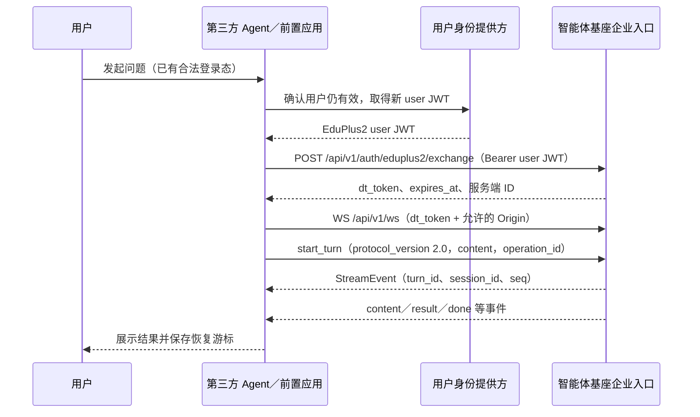
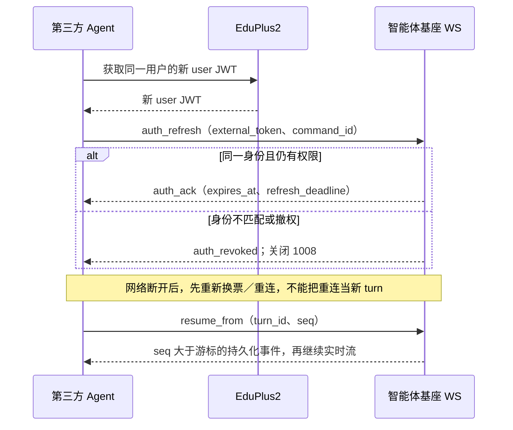

# 调用链路

下图是当前**企业入口**的正常调用顺序，不把部署方前置应用或 EduPlus2 系统能力当作基座已开放的 Agent API。前置应用须先取得可信用户身份和允许的 Origin；基座按用户授权验证，而不是信任 Agent 自报的学校 ID。

## 关键控制点

1. **换票**：HTTP `exchange` 以外部 user JWT 为凭证；`tenant_id`、`user_id` 与注册 ID 是服务端解析结果。`X-Request-ID` 仅用于关联诊断。重复提交同一 JWT 可能触发 replay。
2. **资源**：如需附件，先通过 `POST /api/v1/resources/upload-intents` 获取上传意向，向预签名地址上传字节，再 `POST /api/v1/resources/upload-intents/{resource_id}/complete`。随后在 WS `start_turn.resource_ids` 引用稳定 ID；生产入口拒绝直接 `attachments`。
3. **发起 turn**：`content` 必填；当前企业入口仅支持 `chat`，可省略 `capability` 或显式传 `chat`。新对话不传 `session_id`，追问用先前事件中的 `session_id`。`operation_id` 用于同一次发起操作的幂等识别，重试不能改成新 ID。
4. **消费结果**：收到首个流事件后记录服务端 `turn_id`、`session_id` 和每个已处理事件的最大 `seq`。`result` 是统一结果载荷；`content` 供增量展示，`done` 表示 turn 结束。按 `(turn_id, seq)` 去重，别只靠消息文本去重。

## 长连接刷新与断线

`subscribe_turn.after_seq` 与 `resume_from.seq` 都是**最后已处理**的序号；服务端返回更大的序号。断线时已知 `turn_id` 应直接恢复订阅，不再 `start_turn`。若首事件前断线，客户端应在发送前已保存完整 `start_turn` 请求；合法重连后原样重发同一请求及 `operation_id`，由服务端识别同一操作。新会话此时尚无 `session_id`，不能要求先查活跃 turn；已有会话可用 `check_active_turn` 辅助核对。幂等记录有保留期，超过保留期不能自动重发；不要用新操作 ID 制造重复 turn。

连接恢复可能重放 `done` 前后的事件；客户端要按序号去重。会话所有权、资源权限、撤权状态会再次检查，恢复不绕过认证。命令及事件细节见 [WebSocket 协议](websocket-protocol.mdx)，HTTP 查询见 [API 目录](http-api.mdx)。
