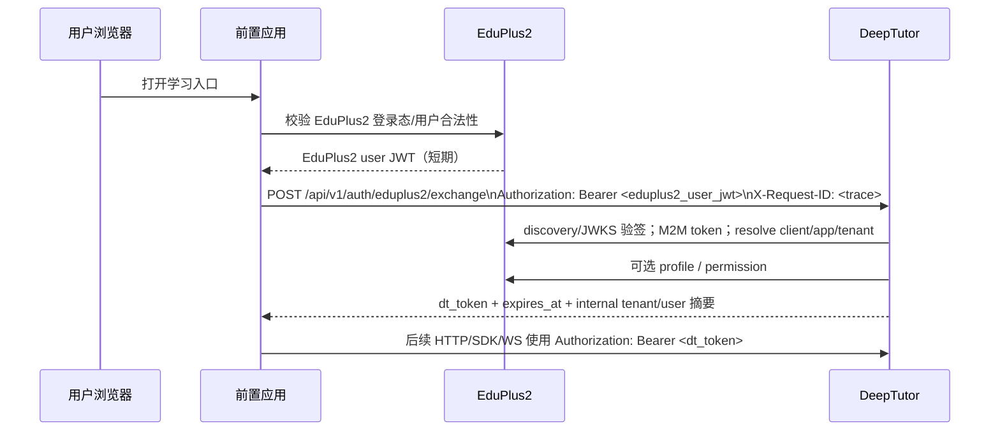
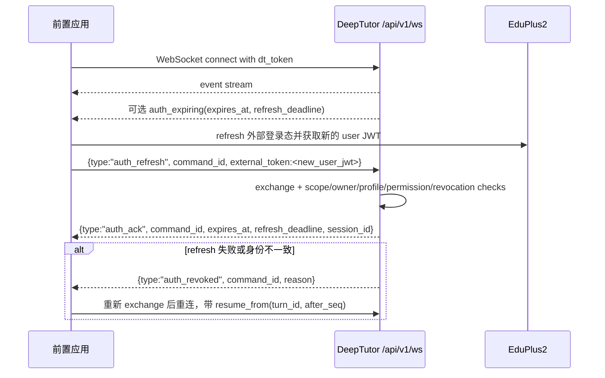
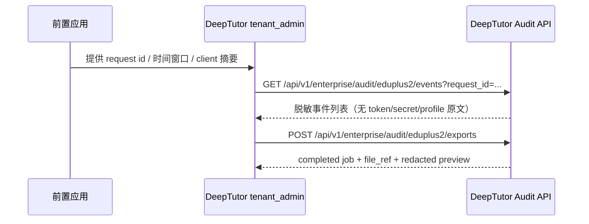

# EduPlus2 前置应用接入联调契约（P1）

> 状态：P1 前置应用接入契约与 smoke 包。本文面向前置应用团队、DeepTutor 部署方和联调人员；完成本文契约不代表 TMS/OMS、Handoff/OIDC callback、在线 client 治理、实时撤权 SLA、M1/G1 或生产上线完成。
>
> 需求来源：正式 OpenSpec [`enterprise-eduplus2-federated-access`](../../openspec/specs/enterprise-eduplus2-federated-access/spec.md) 与当前已实现 API/测试。P1 proposal 的执行证据随 OpenSpec change 归档维护，不作为本文主契约来源。

## 1. 边界与职责

### 1.1 系统边界

```text
EduPlus2 OIDC/JWKS + open APIs
        ↑  user JWT / M2M token / resolve/profile/permission
        │
前置应用（浏览器外壳或服务端 BFF） ── POST /api/v1/auth/eduplus2/exchange ── DeepTutor 企业入口
        │                                                        │
        │  Authorization: Bearer <dt_token>                     │
        └──────────── HTTP / SDK / WebSocket /api/v1/ws ─────────┘
                                                                 │
                                      PostgreSQL tenant scope / owner guard / audit
```

DeepTutor 当前 repo 已实现的边界：

- `POST /api/v1/auth/eduplus2/exchange`：EduPlus2 user JWT 换取短期 DeepTutor `dt_token`。
- `/api/v1/ws` 通用 `auth_refresh` / `auth_ack` / `auth_revoked` seam。
- `GET /api/v1/enterprise/audit/eduplus2/events` 与 `POST /api/v1/enterprise/audit/eduplus2/exports`。
- owner/resource guard、短期 token、审计脱敏、可选 profile/permission/webhook 增强。

非目标：

- 不实现 `/tms`、`/oms`、Handoff/OIDC callback 或在线 client 治理页面。
- 不让 DeepTutor 承担前置应用的打开前、refresh 时或周期窗口内外部用户合法性调度。
- 不承诺实时撤权传播 SLA；没有 webhook 或轮询 SLA 时，外部撤权窗口由前置应用策略决定。
- 不提交、记录或展示 EduPlus2 user JWT、DeepTutor `dt_token`、client secret、M2M token、签名或用户隐私原文。

### 1.2 职责分界

| 事项 | 前置应用负责 | DeepTutor 当前 repo 负责 |
| --- | --- | --- |
| 打开 DeepTutor 前的 EduPlus2 登录态和用户合法性 | 是。确认当前用户仍可进入，并获取新的 EduPlus2 user JWT。 | 否。只在收到 exchange/refresh/敏感操作时做自身信任边界校验。 |
| 周期合法性校验 | 是。决定检查间隔、用户提示、撤权窗口与重新进入策略。 | 否。不实现独立周期调度任务。 |
| `POST /exchange` | 调用时只携带 `Authorization: Bearer <eduplus2_user_jwt>` 和可选 request id。 | 验签 JWT、resolve/allowlist、profile/permission 可选校验、JIT binding、签发短 `dt_token`、审计。 |
| `dt_token` 保存 | 只放在服务端会话、内存或安全 cookie；不要放入 localStorage/sessionStorage/URL。 | 校验签名、过期时间、tenant/user/session、EduPlus2 claim、撤权/permission snapshot 和 owner guard。 |
| HTTP / SDK 调用 | 使用 `Authorization: Bearer <dt_token>`。不得传 body/query/header tenant/user/client 覆盖身份。 | 从 token 恢复可信 scope 并执行资源授权。 |
| WebSocket 长连接 | 临近过期时换取新证明，发送 `auth_refresh`；失败时重新 exchange 后重连并 `resume_from`。 | 校验刷新证明，身份不得变更或扩大授权；成功返回 `auth_ack`，失败返回 `auth_revoked` 或关闭连接。 |
| 审计排障 | 提供 `X-Request-ID` / trace id 给 DeepTutor 管理员。 | tenant_admin 查询/导出脱敏审计；普通用户 403。 |

## 2. 端到端时序

### 2.1 打开与换票



### 2.2 WebSocket refresh 与恢复



### 2.3 审计排障



## 3. HTTP exchange contract

### 3.1 请求

```http
POST /api/v1/auth/eduplus2/exchange HTTP/1.1
Authorization: Bearer <eduplus2_user_jwt>
X-Request-ID: <fronting-app-trace-id>
Content-Type: application/json

{}
```

要求：

- 身份断言只能来自 `Authorization: Bearer <eduplus2_user_jwt>`。
- JWT 必须由 EduPlus2 OIDC/JWKS 验签并校验 `iss`、`exp`、`iat`、`nbf`、`tid`、`eui`、`sub`、`azp`。
- `azp` 是 OAuth client id 主校验项；`aud` 不能替代 `azp`。
- 请求 body、query string 或非签名 header 中的 `tenant_id`、`tenant`、`user_id`、`eui`、`client_id`、`app_id` 不能作为授权证据，示例中不得传这些字段来覆盖 JWT claims。
- `X-Request-ID` 可选但强烈建议由前置应用生成并贯穿 EduPlus2、DeepTutor 和日志系统。

禁止字段示例（不要这样做）：

```json
{
  "tenant_id": "forged-or-display-only",
  "user_id": "forged-or-display-only",
  "client_id": "forged-or-display-only"
}
```

DeepTutor 当前实现即使收到上述 body，也只以验签 JWT、resolve、registration 和本地状态作为授权依据；前置应用不得依赖 body 被接受。

### 3.2 成功响应

当前实现返回字段如下：

```json
{
  "dt_token": "<deeptutor-dt-token>",
  "token_type": "Bearer",
  "expires_in": 900,
  "expires_at": 1790000000,
  "tenant_id": "<internal-tenant-id>",
  "user_id": "<internal-user-id>",
  "client_registration_id": "<internal-registration-id>"
}
```

处理规则：

- 前置应用只将 `dt_token` 用作 DeepTutor 的 bearer token，不解析它来做业务授权决策。
- `expires_at` / `expires_in` 用于安排刷新；建议在过期前 3–5 分钟或 `refresh_deadline` 前刷新。
- `tenant_id`、`user_id`、`client_registration_id` 是 DeepTutor 内部摘要，不允许前置应用在后续请求中反向提交并试图覆盖 token scope。
- 响应不会返回 EduPlus2 user JWT、raw claims、refresh token、client secret、M2M token 或完整 profile。

### 3.3 错误码与恢复策略

| 场景 | 当前 DeepTutor 响应 | 前置应用处理 |
| --- | --- | --- |
| 缺少 Authorization、JWT 无效、JWT 过期、签名/issuer/claim 不合法 | `401 {"detail":"Authentication required"}` | 从 EduPlus2 重新获取登录态或提示重新进入；不要把旧 JWT 放入 URL 或日志。 |
| token replay 被拒绝 | 当前 API 归类为 `401`；审计 reason 为 `token_replay` | 不重放同一 user JWT；获取新的用户 JWT 后再尝试，避免并发刷票。 |
| client 未注册、暂停、撤销或 `azp` 未 allowlist | `403 {"detail":"Forbidden"}` | 停止调用，提示应用未授权或联系管理员；不要切换为其他 client。 |
| JWT tenant 与 registration/resolve/profile/permission 不一致 | `409 {"detail":"Operation conflict"}` | 阻断联调，视为配置冲突；核对 allowlist、EduPlus2 tenant/app/client 绑定。 |
| 同一 user/client 短时间超出 exchange 限流 | `429 {"detail":"Authentication temporarily limited"}` | 指数退避；不要循环获取 JWT 或并发重试。 |
| EduPlus2 discovery/JWKS/token/resolve/profile/permission 不可用，或 DeepTutor DB/lease 不可用 | `503 {"detail":"Service unavailable"}` | 降级提示稍后重试；保留 request id 便于排查。 |
| owner/resource guard denied | HTTP `403` 或 `404`，并写 `authz.denied` 审计 | 不换 tenant/user 重试，不暴露资源是否存在；提示无权访问或资源不可用。 |

### 3.4 幂等、重放和限流

- 同一个 EduPlus2 user JWT 被重复 exchange 会被视为 replay；前置应用必须缓存“正在换票”的 Promise 或在 BFF 侧串行化，避免多标签页/多请求并发重放。
- `dt_token` 是短期 bearer token，不返回 refresh token。刷新时应重新向 EduPlus2 获取 user JWT 或通过已换得的新 `dt_token` 走 WS `auth_refresh`。
- 对 `401/403/409` 不做无限重试；对 `429/503` 使用指数退避，并在 UI 中提示稍后重试或联系管理员。

## 4. 后续 HTTP / SDK contract

HTTP 与远端 SDK 调用统一使用：

```http
Authorization: Bearer <dt_token>
X-Request-ID: <fronting-app-trace-id>
```

约束：

1. 不在 body/query/header 中传 `tenant_id`、`tenant`、`user_id`、`client_id` 作为授权依据。
2. 不允许通过客户端 payload 中的 `metadata.tenant_id`、`metadata.user_id` 切换 DeepTutor scope。
3. 租户成员身份、EduPlus2 登录成功或 tenant_admin 角色都不自动授予个人 session、memory、notebook、artifact/source 访问权；仍需 owner、显式 grant 或 resource guard 通过。
4. SDK 服务端集成也先调用 exchange，再用 `dt_token` 调 DeepTutor；如需服务端 M2M 能力，应另立契约并限制租户范围。

## 5. WebSocket contract

### 5.1 `auth_refresh` 请求

```json
{
  "type": "auth_refresh",
  "command_id": "fronting-refresh-001",
  "protocol_version": 1,
  "dt_token": "<new-deeptutor-dt-token>"
}
```

或由企业 provider 解释外部证明：

```json
{
  "type": "auth_refresh",
  "command_id": "fronting-refresh-001",
  "protocol_version": 1,
  "external_token": "<new-eduplus2-user-jwt>"
}
```

规则：

- `dt_token` 与 `external_token` 二选一；都缺失时失败。
- refresh 后的 internal tenant、internal user、role、EduPlus2 `client_registration_id`、`external_tenant_id`、`external_app_id`、`external_user_id`、`azp` 必须与当前 WS 身份一致，不得换人或扩大 scope。
- `command_id` 应由前置应用生成，便于幂等处理和审计关联。

### 5.2 成功响应 `auth_ack`

```json
{
  "type": "auth_ack",
  "command_id": "fronting-refresh-001",
  "expires_at": 1790000000,
  "refresh_deadline": 1789999700,
  "session_id": "<deeptutor-session-id>"
}
```

收到 `auth_ack` 后，前置应用继续使用同一 WS 连接。若之前因网络断开重连，使用 `resume_from` 恢复事件流。

### 5.3 失败响应和重连恢复

失败可能表现为：

```json
{
  "type": "auth_revoked",
  "command_id": "fronting-refresh-001",
  "reason": "Authentication or operation rejected"
}
```

或连接被关闭。前置应用处理：

1. 停止在旧连接上发起新 turn、cancel、reply、download 或敏感工具操作。
2. 向 EduPlus2 重新获取 user JWT。
3. 调用 HTTP exchange 获取新 `dt_token`。
4. 重新连接 `/api/v1/ws`。
5. 使用 `resume_from` 携带 `turn_id` 与 `after_seq` 恢复事件流；不要重放已经确认的用户操作。

## 6. 配置矩阵与 Secret ref

### 6.1 本地联调文件（只读入，不提交值）

`.secrets/token-test.secrets` 当前用于 P1 smoke 的 key 名称：

| Key | 来源 | 用途 | 可写入文档/日志 |
| --- | --- | --- | --- |
| `TOKEN` | 前置应用或测试人员从 EduPlus2 获取 | EduPlus2 user JWT | 否 |
| `ClientID` | EduPlus2 测试 client 元数据 | 与 JWT `azp` 对齐检查 | 可写 key 名，不写真实值 |
| `ClientSecret` | EduPlus2 测试 client secret | M2M token smoke 输入 | 否 |

`.secrets/deeptutor-local-eduplus2.env` 当前涉及的 key 名称：

| Key | DeepTutor 是否读取 | 说明 |
| --- | --- | --- |
| `DT_EDUPLUS2_BASE_URL` | 是（用于派生 URL） | EduPlus2 base URL。 |
| `DT_EDUPLUS2_DISCOVERY_URL` | 是 | OIDC discovery。 |
| `DT_EDUPLUS2_OIDC_ISSUER` | 是 | 可选 issuer 覆盖。 |
| `DT_EDUPLUS2_JWKS_URI` | 是 | 可选 JWKS 覆盖。 |
| `DT_EDUPLUS2_TOKEN_ENDPOINT` | 是 | M2M client credentials token endpoint。 |
| `DT_EDUPLUS2_RESOLVE_URL` | 是 | `POST /api/v1/open/oauth-clients/resolve`；缺省由 base URL 派生。 |
| `DT_EDUPLUS2_PROFILE_URL` | 是（可选增强） | profile 复核 endpoint；本地/联调环境如不启用可显式设为 `off`/`disabled`/`none`/`0`/`false`/`no`，避免由 base URL 自动派生。 |
| `DT_EDUPLUS2_PERMISSION_URL` | 是（可选增强） | permission 复核 endpoint；本地/联调环境如不启用可显式设为 `off`/`disabled`/`none`/`0`/`false`/`no`，避免由 base URL 自动派生。 |
| `DT_EDUPLUS2_CLIENT_ID` | 是 | DeepTutor 调 EduPlus2 open APIs 的 M2M client id。 |
| `DT_EDUPLUS2_CLIENT_SECRET_REF` | 是 | 当前 Secret resolver 支持 `env:VAR_NAME`；生产可把 K8s Secret 注入环境变量后使用 `env:`。 |
| `DT_EDUPLUS2_CLIENT_SECRET` | 是（通过 ref 间接读取或本地兜底） | 本地测试值；不打印不提交。 |
| `DT_EDUPLUS2_ALLOWED_CLIENTS` | 是 | JSON 或 `client_id:tenant[:app[:internal_tenant]]`；用于 allowlist/auto-upsert。 |
| `DT_EDUPLUS2_DT_TOKEN_TTL_SECONDS` | 是（可选） | DeepTutor `dt_token` TTL，必须短于内部 token 上限。 |
| `DT_EDUPLUS2_REFRESH_DEADLINE_LEEWAY_SECONDS` | 是（可选） | WS `refresh_deadline` 提前量。 |
| `DT_EDUPLUS2_REVOCATION_CACHE_TTL_SECONDS` | 是（可选） | 可选撤权/permission snapshot 重验窗口。 |
| `DT_EDUPLUS2_AUDIT_EXPORT_STORAGE_REF` | 是（可选） | 审计导出存储引用，默认 `db://eduplus2/audit-export`。 |
| `DT_EDUPLUS2_REVOCATION_WEBHOOK_SECRET_REF` | 是（可选 webhook） | 当前代码读取的 revocation webhook secret ref。 |
| `DT_EDUPLUS2_REVOCATION_WEBHOOK_SECRET` | 是（本地兜底） | 仅在配置 webhook 时使用；不打印不提交。 |
| `DT_EDUPLUS2_AUTHORIZATION_ENDPOINT` 等 OIDC 辅助 URL | 不作为当前 exchange 必需项 | 可供前置应用或后续 handoff proposal 使用。 |

### 6.2 local / test / prod 建议

| 环境 | user JWT 来源 | DeepTutor 读取的 Secret ref | 前置应用读取 | 备注 |
| --- | --- | --- | --- | --- |
| local | `.secrets/token-test.secrets:TOKEN`，由测试人员刷新 | `DT_EDUPLUS2_CLIENT_SECRET_REF=env:DT_EDUPLUS2_CLIENT_SECRET`；可选 `DT_EDUPLUS2_REVOCATION_WEBHOOK_SECRET_REF=env:DT_EDUPLUS2_REVOCATION_WEBHOOK_SECRET` | 前置应用本地配置或手工 token | 只用于联调；不要把 token/secret 写入证据。 |
| test | 前置应用测试环境实时获取 | K8s/CI 注入 env 后仍使用 `env:<VAR>` ref | 前置应用自己的 EduPlus2 client secret 或 BFF secret | DeepTutor 与前置应用的 client 可以不同；确保 JWT `azp` 在 DeepTutor allowlist 中。 |
| prod | 前置应用运行时获取，不落盘 | 生产 Secret 注入环境变量；文档只记录 ref 名和 key 名 | 前置应用按自身 Secret 管理 | 变更 client/app/tenant 绑定需走受控发布和审计。 |

## 7. 审计查询与导出 contract

### 7.1 查询

```http
GET /api/v1/enterprise/audit/eduplus2/events?event_kind=token.exchange&request_id=<id>&limit=100
Authorization: Bearer <tenant_admin_dt_token>
```

支持筛选参数：

- `event_kind`
- `client_id`
- `external_tenant_id`
- `external_app_id`
- `external_user_id`
- `internal_user_id`
- `result`
- `request_id`
- `limit`（当前查询 API 上限 500）

权限与脱敏：

- 普通用户或无权限 token 返回 `403 {"detail":"Forbidden"}`。
- `tenant_admin` 只能查看当前 tenant scope 内事件。
- 返回字段包括 request id、event kind、client/app/tenant/user 摘要、result、reason、policy version、summary 和 created_at。
- 审计 summary 会移除 `token`、`jwt`、`secret`、`authorization`、`client_secret` 等敏感键；调用方仍不得把 token 放进 request id 或 reason。

### 7.2 导出

```http
POST /api/v1/enterprise/audit/eduplus2/exports
Authorization: Bearer <tenant_admin_dt_token>
Content-Type: application/json

{
  "format": "jsonl",
  "event_kind": "token.exchange",
  "request_id": "fronting-trace-001",
  "limit": 1000
}
```

字段：

- `format`: `jsonl` 或 `csv`。
- 过滤字段与查询 API 一致；导出 request model 上限 5000。
- 成功返回 `id`、`status`、`format`、`row_count`、`file_ref`、`expires_at` 和 `preview`。
- 导出本身会写 `audit.export` 审计。`preview` 也必须脱敏，不包含 raw token、client secret、完整 profile 或私密正文。

## 8. 错误矩阵与用户提示

| 分类 | DeepTutor / WS 信号 | 是否重试 | 前置应用用户提示 | 排障要点 |
| --- | --- | --- | --- | --- |
| 未登录/登录过期 | HTTP 401；WS 关闭或 `auth_revoked` | 获取新 EduPlus2 登录态后重试一次 | “登录状态已过期，请重新进入。” | 检查 user JWT `exp/nbf/iss/azp`。 |
| 应用未授权 | HTTP 403 | 不自动重试 | “当前应用未获得 DeepTutor 授权，请联系管理员。” | 检查 allowlist、registration status、client/app 状态。 |
| 配置冲突 | HTTP 409 | 不重试 | “应用配置冲突，已阻止访问。” | 对齐 JWT `tid`、resolve tenant、allowed clients、profile/permission tenant。 |
| 限流/重放 | HTTP 429 或 replay 类 401 | 对 429 指数退避；replay 不重放同一 JWT | “请求过于频繁，请稍后重试。” | 检查多标签页并发 exchange；同一 JWT 是否重复使用。 |
| EduPlus2 open API 不可用 | HTTP 503 | 指数退避，有上限 | “服务暂不可用，请稍后再试。” | discovery/JWKS/token/resolve/profile/permission endpoint、M2M secret。 |
| owner guard denied | HTTP 403/404 | 不换身份重试 | “无权访问该资源或资源不可用。” | request id 查 `authz.denied`，不暴露资源存在性。 |
| WS refresh 身份不一致 | `auth_revoked` 或 close | 重新 exchange 后重连 | “连接已失效，正在恢复。” | 确保 refresh 后 tenant/user/client/app 与旧连接一致。 |
| audit export denied | HTTP 403 | 不重试 | “无审计导出权限。” | 使用 tenant_admin token；检查角色。 |

## 9. 安全禁令

1. 不把 EduPlus2 user JWT、DeepTutor `dt_token`、client secret、M2M token、webhook secret、签名值写入普通日志、审计正文、OpenSpec、文档、浏览器可读存储、URL 或错误消息。
2. 不在前端 localStorage/sessionStorage 保存 bearer token；优先使用 BFF/server session、内存或 httpOnly secure cookie。
3. 不从 body/query/header 接受 tenant/user/client 授权覆盖。
4. 不把 tenant_admin 等同于个人内容 owner；个人 session/memory/notebook/artifact 仍需 owner/grant。
5. 不把 P1 契约或 smoke 通过解释为 TMS/OMS、M1/G1、生产上线或实时撤权 SLA 已完成。

## 10. Smoke 命令与证据模板

### 10.1 P1 dry-run

```bash
./.venv/bin/python scripts/enterprise/eduplus2_fronting_app_smoke.py \
  --dry-run \
  --token-file .secrets/token-test.secrets \
  --env-file .secrets/deeptutor-local-eduplus2.env
```

输出为 JSON 摘要：

- `overall_status`: `ok` 或 `failed`。
- `steps.configuration.loaded_key_names`: 只列 key 名，不列值。
- `steps.user_jwt.claims.*_sha256`: 只输出 tenant/user/subject 摘要。
- `steps.user_jwt.valid_now` 与 `azp_matches_client`。
- `negative_cases`: 说明 missing token 与 expired token 的 fail-closed 形态。
- 不输出 raw JWT、`dt_token`、client secret 或 M2M token。

### 10.2 真实 EduPlus2 discovery/M2M/resolve smoke

在确认 `.secrets` 已刷新且允许访问 test endpoint 后运行：

```bash
set -a
. .secrets/deeptutor-local-eduplus2.env
set +a
./.venv/bin/python scripts/enterprise/eduplus2_fronting_app_smoke.py \
  --real \
  --token-file .secrets/token-test.secrets \
  --env-file .secrets/deeptutor-local-eduplus2.env
```

若已有本地/测试 DeepTutor 企业入口 URL，可补充 exchange 与 `dt_token` 解码：

```bash
./.venv/bin/python scripts/enterprise/eduplus2_fronting_app_smoke.py \
  --real \
  --deeptutor-url https://<deeptutor-test-host> \
  --token-file .secrets/token-test.secrets \
  --env-file .secrets/deeptutor-local-eduplus2.env
```

### 10.3 复用现有 pytest 的 WS 与审计验证

WS refresh：

```bash
PYTHONPATH=extensions/enterprise/src \
./.venv/bin/python -m pytest \
  extensions/enterprise/tests/test_eduplus2_federated_access.py::test_ws_auth_refresh_accepts_only_same_eduplus2_identity \
  -q
```

审计查询/导出与普通用户 403：

```bash
PYTHONPATH=extensions/enterprise/src \
./.venv/bin/python -m pytest \
  extensions/enterprise/tests/test_eduplus2_federated_access.py::test_audit_query_and_export_api_requires_tenant_admin \
  -q
```

脚本和上述 pytest 的证据记录在对应 OpenSpec change 的 `execution-evidence.md`。证据只允许记录命令、退出码、脱敏状态、request id、过期时间窗口、client/app/tenant 摘要和未验证项。
